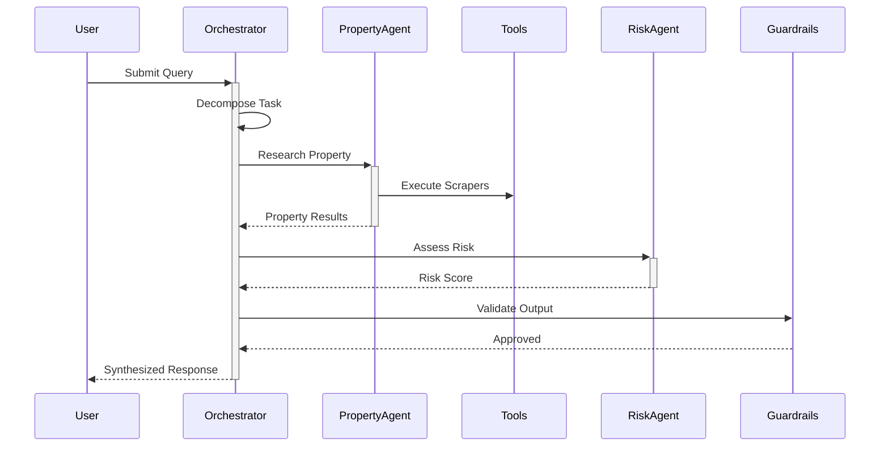

# DataGod Agentic System Architecture

This document describes the agentic AI system architecture that powers DataGod's intelligent research capabilities.

## Overview

DataGod implements a multi-agent orchestration system following the DNA Strand architecture pattern. The system enables autonomous task decomposition, specialist agent routing, and transparent decision-making with human-in-the-loop (HITL) controls.

## Agent Hierarchy

```
┌─────────────────────────────────────────────────────────────────┐
│                     ORCHESTRATOR AGENT                          │
│  (Central coordinator for all agent tasks)                      │
└─────────────────────────┬───────────────────────────────────────┘
                          │
          ┌───────────────┼───────────────┐
          │               │               │
          ▼               ▼               ▼
┌─────────────────┐ ┌─────────────────┐ ┌─────────────────┐
│ Property        │ │ Entity          │ │ Lien Priority   │
│ Research Agent  │ │ Resolution Agent│ │ Agent           │
└─────────────────┘ └─────────────────┘ └─────────────────┘
          │               │               │
          ▼               ▼               ▼
┌─────────────────┐ ┌─────────────────┐ ┌─────────────────┐
│ Risk Assessment │ │ Document        │ │ Verification    │
│ Agent           │ │ Analysis Agent  │ │ Agent           │
└─────────────────┘ └─────────────────┘ └─────────────────┘
```

## Core Components

### 1. Orchestrator Agent
**Location**: `datagod/agents/orchestrator.py`

Responsibilities:
- Task decomposition: Break complex queries into subtasks
- Agent routing: Assign subtasks to specialist agents
- Result synthesis: Combine outputs into coherent responses
- Confidence assessment: Evaluate reliability of results

### 2. Specialist Agents
**Location**: `datagod/agents/specialists.py`

| Agent | Purpose |
|-------|---------|
| PropertyResearchAgent | Property records, ownership, deeds |
| EntityResolutionAgent | Entity matching, disambiguation |
| LienPriorityAgent | Lien analysis, priority stacks |
| RiskAssessmentAgent | Red flag detection, risk scoring |

### 3. Tool Registry
**Location**: `datagod/agents/tool_registry.py`

Centralized registry for all agent tools with:
- Tool discovery and registration
- Parameter validation
- Execution logging
- Error handling

### 4. Guardrail Engine
**Location**: `datagod/agents/guardrails.py`

Safety and compliance controls:
- Output validation
- Sensitivity detection
- HITL approval triggers
- Audit trail generation

## Data Flow



## Confidence Levels

All agent outputs include confidence assessments:

| Level | Score | Description |
|-------|-------|-------------|
| HIGH | 0.8-1.0 | Multiple verified sources |
| MEDIUM | 0.6-0.8 | Single verified source |
| LOW | 0.4-0.6 | Unverified source |
| UNCERTAIN | <0.4 | Requires human review |

## HITL Approval Flow

When confidence is LOW or UNCERTAIN:
1. Output is flagged for human review
2. Evidence chain is presented
3. Human approves/rejects/modifies
4. Decision is logged for audit

## API Integration

```python
from datagod.agents import OrchestratorAgent

# Initialize orchestrator
orchestrator = OrchestratorAgent()

# Process query
result = await orchestrator.process_query(
    query="Find all properties owned by John Smith in Harris County",
    context={"jurisdiction": "TX-Harris"},
    user_id=123
)
```

## Evidence Tracking

All outputs include provenance:
- Source documents
- Extraction timestamps
- Confidence scores
- Agent action log

## Security

- Role-based access control (RBAC)
- Audit logging of all agent actions
- PII detection and handling
- Rate limiting per user/tier
