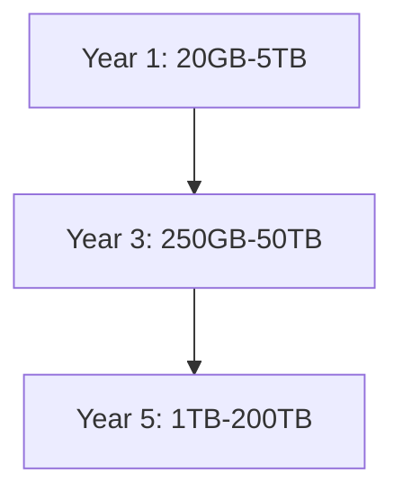
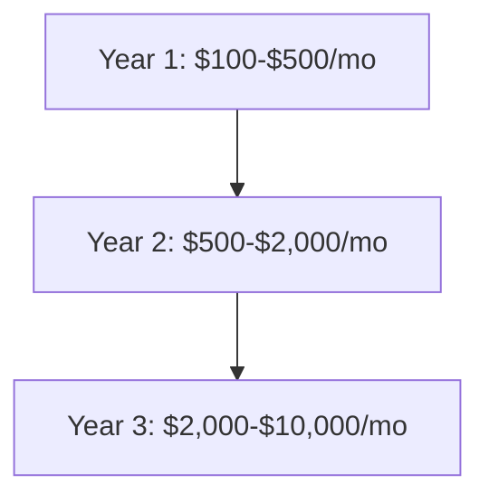

# DataGod Capacity Planning

## Data Volume Projections

### Current Data Volume
- **Jurisdictions**: 100+ currently documented
- **Records per jurisdiction**: 100-10,000 (varies by jurisdiction size)
- **Total records**: ~500,000
- **Growth rate**: ~50,000 records/month

### Expected Data Volume (12 months)
- **Jurisdictions**: 10,000+ targeted
- **Records per jurisdiction**: 1,000-100,000 average
- **Total expected records**: 10M-1B
- **Growth rate**: 100K records/month (conservative)
- **Growth rate**: 500K records/month (aggressive)

### 3-Year Projections
- **Jurisdictions**: 25,000+
- **Total records**: 50M-5B
- **Growth rate**: 200K-1M records/month

### 5-Year Projections
- **Jurisdictions**: 50,000+
- **Total records**: 100M-10B
- **Growth rate**: 300K-2M records/month

## Storage Requirements

### Average Record Size Estimation
- **Basic record**: 1-2KB (text fields only)
- **Enhanced record**: 5-10KB (with metadata, relationships)
- **Complete record**: 10-50KB (with attachments, images, full data)

### Total Storage Calculation
| Scenario | Records | Avg Size | Total Storage |
|----------|---------|----------|---------------|
| Conservative (1 year) | 10M | 2KB | 20GB |
| Aggressive (1 year) | 1B | 5KB | 5TB |
| Conservative (3 years) | 50M | 5KB | 250GB |
| Aggressive (3 years) | 5B | 10KB | 50TB |
| Conservative (5 years) | 100M | 10KB | 1TB |
| Aggressive (5 years) | 10B | 20KB | 200TB |

### Storage Growth Projection

## Concurrent User Load

### Expected Daily Active Users
- **Initial launch**: 100-500 users
- **6 months**: 1,000-5,000 users
- **12 months**: 5,000-25,000 users
- **24 months**: 25,000-100,000 users

### Peak Concurrent Users
- **Initial**: 50-100 concurrent
- **6 months**: 200-500 concurrent
- **12 months**: 1,000-2,500 concurrent
- **24 months**: 5,000-10,000 concurrent

### API Requests per User
- **Basic user**: 10-20 requests/minute
- **Power user**: 50-100 requests/minute
- **API client**: 100-500 requests/minute

### Database Connection Requirements
| Timeframe | Concurrent Users | Req/User | Total RPM | Connections Needed |
|-----------|------------------|----------|-----------|--------------------|
| Launch | 100 | 20 | 2,000 | 20-50 |
| 6 months | 500 | 30 | 15,000 | 50-100 |
| 12 months | 2,500 | 40 | 100,000 | 100-200 |
| 24 months | 10,000 | 50 | 500,000 | 200-500 |

## Query Complexity

### Planned Query Types
1. **Simple CRUD operations** (Create, Read, Update, Delete)
2. **Complex joins** (Jurisdiction + Data Source + Records + Entities)
3. **Full-text search** (Search across record content)
4. **Geospatial queries** (Search by location/coordinates)
5. **Aggregation queries** (Statistics, analytics, reporting)
6. **Relationship queries** (Entity relationship mapping)
7. **Temporal queries** (Time-based filtering and analysis)

### Query Complexity Analysis
| Query Type | Tables Involved | Join Depth | Expected Frequency |
|------------|-----------------|------------|--------------------|
| Simple CRUD | 1 | 0 | Very High |
| Basic Search | 2-3 | 1-2 | High |
| Advanced Search | 4-6 | 3-5 | Medium |
| Full-text Search | 3-5 | 2-4 | Medium |
| Geospatial | 2-4 | 1-3 | Low-Medium |
| Aggregation | 3-6 | 2-5 | Medium |
| Relationship | 4-8 | 3-7 | Low |

## Budget Constraints

### Database Cost Comparison

#### Self-Hosted Options
| Option | Initial Cost | Monthly Cost | Scalability | Maintenance |
|--------|--------------|--------------|-------------|-------------|
| SQLite | $0 | $0 | Limited | Low |
| PostgreSQL (self-hosted) | $0 | $50-$500 | High | Medium |

#### Cloud Database Options
| Provider | Service | Monthly Cost (10M records) | Monthly Cost (1B records) | Scalability |
|----------|---------|----------------------------|----------------------------|-------------|
| AWS | RDS PostgreSQL | $100-$500 | $2,000-$10,000 | Very High |
| AWS | Aurora PostgreSQL | $200-$800 | $3,000-$15,000 | Very High |
| Google Cloud | Cloud SQL PostgreSQL | $150-$600 | $2,500-$12,000 | Very High |
| Azure | Azure Database for PostgreSQL | $120-$550 | $2,200-$11,000 | Very High |

### Cost Projection (3 Years)

## Decision Matrix

### Database Selection Criteria
| Criteria | Weight | SQLite | PostgreSQL | Notes |
|----------|--------|--------|------------|-------|
| **Scalability** | 30% | 3/10 | 10/10 | PostgreSQL handles large datasets better |
| **Performance** | 25% | 6/10 | 9/10 | PostgreSQL has better query optimization |
| **Cost** | 15% | 10/10 | 7/10 | SQLite is free, PostgreSQL has cloud costs |
| **Features** | 20% | 6/10 | 10/10 | PostgreSQL has advanced features |
| **Complexity** | 10% | 9/10 | 6/10 | SQLite is simpler to set up |

### Scoring
| Database | Scalability | Performance | Cost | Features | Complexity | **Total** |
|----------|-------------|-------------|------|----------|------------|-----------|
| SQLite | 0.9 | 1.5 | 1.5 | 1.2 | 0.9 | **6.0** |
| PostgreSQL | 3.0 | 2.25 | 1.05 | 2.0 | 0.6 | **8.9** |

## Recommendation

### ✅ Recommended: PostgreSQL

**Rationale:**
1. **Better Scalability**: Handles 10M-1B records efficiently
2. **Advanced Features**: Full-text search, JSON support, geographic data types
3. **Performance**: Better query optimization for complex joins
4. **Concurrency**: Handles multiple concurrent users effectively
5. **Ecosystem**: Rich ecosystem of tools and extensions
6. **Future-proof**: Can scale from small to enterprise-level datasets

### Implementation Plan:
1. **Start with self-hosted PostgreSQL** for cost savings
2. **Migrate to cloud (AWS RDS/Aurora)** when scaling beyond 50M records
3. **Use connection pooling** to manage database connections efficiently
4. **Implement proper indexing** for performance optimization
5. **Set up regular backups** and monitoring

### Configuration Recommendations:
- **Initial Setup**: PostgreSQL 13+ with 4 vCPUs, 16GB RAM, 100GB SSD
- **Connection Pooling**: 20-50 connections initially, scale as needed
- **Backup Strategy**: Daily backups with 30-day retention
- **Monitoring**: Set up performance monitoring and alerting

## Conclusion

PostgreSQL is the clear choice for DataGod's database needs, offering the best balance of scalability, performance, and features required to handle the projected data volume of 10M-1B records and support the platform's growth over the next 3-5 years.